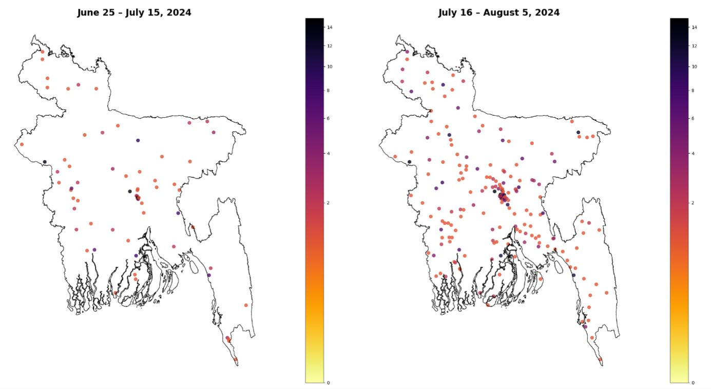

# A Mixed-Methods Analysis of Repression and Mobilization in Bangladesh's July Revolution

**Official code and data for the paper: "A Mixed-Methods Analysis of Repression and Mobilisation in Bangladesh’s July Revolution Using Machine Learning and Statistical Modeling"**

This repository contains the Python code and datasets used for the quantitative analysis of the 2024 July Revolution in Bangladesh. The experiments were performed using Google Colab and standard Python libraries.

> **Summary:** The July 2024 uprising in Bangladesh was a stunningly rapid, student-led movement that successfully overthrew a long-standing government, despite facing a brutal and lethal state crackdown. This research explores the central paradox of the revolution: why did the government's attempts to suppress the protests backfire so spectacularly, ultimately fueling the movement's victory? Using a high-frequency event dataset, we develop a multi-layered analytical framework that integrates econometric models for causal inference with machine learning models for predictive exploration. We find that the "backfire effect" of repression was not a simple, constant phenomenon. Instead, it was a contingent and non-linear dynamic "unlocked" by a clear tipping point around July 16th, coinciding with the first widely publicized killing of a student protester. Our most powerful predictive models (XGBoost, R²=0.65) reveal that the single most important signal for an upcoming protest wave was not the death toll itself, but the visual evidence of police brutality (`Excessive force against protesters`). Our work provides a robust, data-driven account of how a contingent backfire, catalyzed by a moral shock and amplified by the viral spread of visuals, can drive a modern revolution.

---

## Methodology Overview

Our analysis follows a multi-layered framework, designed to move from broad correlations to sharp causal and predictive inference:
1.  **Data Preparation:** Raw event data from ACLED is cleaned and engineered into both a national-level time-series and a division-level panel dataset. Lags and other features are generated.
2.  **Pooled Regression Analysis:** Baseline OLS and Negative Binomial models are used to establish the importance of protest momentum and identify the limitations of a simple correlational approach.
3.  **Causal Inference:** A Two-Way Fixed Effects (PanelOLS) model isolates the direct, causal effect of local repression from confounding regional and national factors.
4.  **Structural Break Analysis:** The Fixed Effects model is augmented with an interaction term to statistically test for a "tipping point" in the conflict's dynamics.
5.  **Dynamic Analysis:** A Vector Autoregression (VAR) model is used to visualize the immediate, day-to-day feedback loops between repression and mobilization.
6.  **Predictive Modeling:** XGBoost and Random Forest models are validated with a rigorous walk-forward cross-validation to identify the most powerful, non-linear predictive signals of escalation.

---

## Key Results

Our layered analysis yielded multiple core, complementary findings including:
*   **A Contingent Backfire:** State violence did cause more protest, but only after a clear **structural break** around July 16th. Before this "tipping point," the effect was statistically insignificant.
*   **The Effect of Visuals:** The single most powerful predictor of a protest wave was the **Excessive force against protesters**. This points to the impact of shocking visuals to circulate and catalyze a mass response.
*   **Predictive Power:** The revolution, while seemingly chaotic, was quantitatively predictable. Our final XGBoost model could explain **~65% of the variance** in the next day's protest events in a rigorous out-of-sample test.



---

## Setup and Installation

This project is built using standard Python 3 libraries.

**1. Clone the repository:**
```bash
git clone https://github.com/Saiful185/July-Revolution-Analysis.git
cd July-Revolution-Analysis
```

**2. Install dependencies:**
It is recommended to use a virtual environment.
```bash
pip install -r requirements.txt
```
Key dependencies include: `pandas`, `statsmodels`, `linearmodels`, `scikit-learn`, and `xgboost`.

---

## Dataset and Notebooks

The data and code are organized for clarity and reproducibility.

#### Datasets (`/Dataset` folder)
The raw data for this project is sourced from the **Armed Conflict Location & Event Data Project (ACLED)**. For convenience, this repository includes the two final, pre-processed datasets used in our analysis:
1.  `daily_event_summary_with_new_columns.csv`: The aggregated, national-level time-series data.
2.  `daily_division_dataset.csv`: The panel dataset at the division-day level.

#### Usage: Running the Analysis
The analysis is broken down into three Jupyter/Colab notebooks (`.ipynb`) that should be run sequentially.
1.  **`Data Preparation.ipynb`:** Loads the raw ACLED data and performs all cleaning, aggregation, and feature engineering to produce the final datasets.
2.  **`EDA.ipynb`:** Contains the Exploratory Data Analysis, including the creation of the time-series plots and correlation matrices.
3.  **`ML and Regression Analysis.ipynb`:** Contains the full, layered quantitative analysis, from the pooled regression models to the final predictive machine learning models.

---

## Citation

If you find this work useful in your research, please consider citing our paper:

```bibtex
@article{siddiqui2025,
      title={A Mixed-Methods Analysis of Repression and Mobilization in Bangladesh's July Revolution Using Machine Learning and Statistical Modeling}, 
      author={Md. Saiful Bari Siddiqui and Anupam Debashis Roy},
      year={2025},
      eprint={2510.06264},
      archivePrefix={arXiv},
      primaryClass={stat.AP},
      url={https://arxiv.org/abs/2510.06264}, 
}
```

---

## License
This project is licensed under the MIT License. See the `LICENSE` file for details.

---

## Acknowledgement
We wish to express their sincere gratitude to Dr. Michael Biggs and Dr. Mathis Ebbinghaus of the Department of Sociology, University of Oxford, whose constructive feedback and methodological guidance were invaluable in refining the research design and analytical approach of this paper. Also, this research would not have been possible without the invaluable, publicly available data compiled by the **Armed Conflict Location & Event Data Project (ACLED)**.
